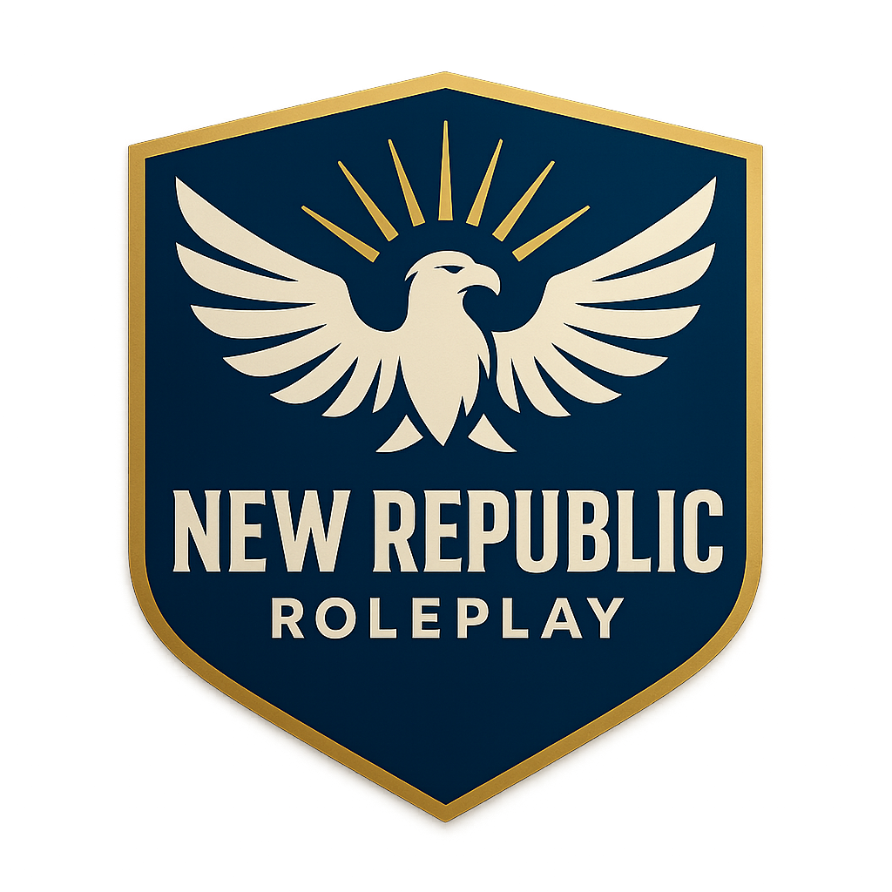

# New Republic RP Guidebook

  

Welcome to the official **New Republic RP Guidebook**.

This guidebook is the central resource for server rules, roleplay expectations, department information, community standards, and support procedures. Whether you are new to FiveM roleplay or an experienced roleplayer, this guide is designed to help you understand how New Republic RP operates and how to get involved.

## What to Expect

New Republic RP provides a **semi-serious roleplay experience** that balances realism, structure, and fun. The server is built around meaningful interactions, detailed departments, active civilian opportunities, emergency services, criminal roleplay, and long-term character development.

Players can participate in law enforcement, fire and EMS, civilian careers, business ownership, criminal storylines, department subdivisions, community events, and realistic emergency response scenes.

## Why New Republic RP?

### Community-Driven

Our community is the foundation of New Republic RP. We value feedback, ideas, and player involvement. The server continues to grow and improve based on the needs of the community and the direction of its members.

### Active and Supportive

New Republic RP is built by people who care about quality roleplay. Our community includes experienced roleplayers, public safety enthusiasts, first responders, military members, and passionate gamers who are ready to help others learn, grow, and enjoy the server.

### Opportunities for Growth

Whether you want to join a department, advance through the ranks, lead a subdivision, open a business, or simply enjoy great patrols and civilian scenes, New Republic RP offers opportunities to grow and make an impact.

## Getting Started

Start with the **Getting Started** section, then review the **General Rules** and **Server Rules** before entering the city. All members are expected to understand and follow the standards listed in this guidebook.

**Welcome to New Republic RP. Your story begins here.**
